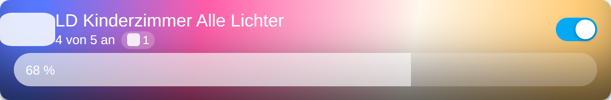
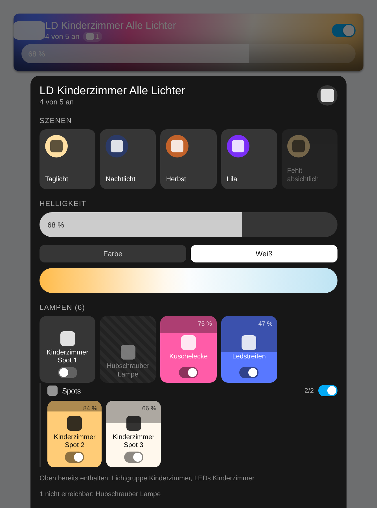
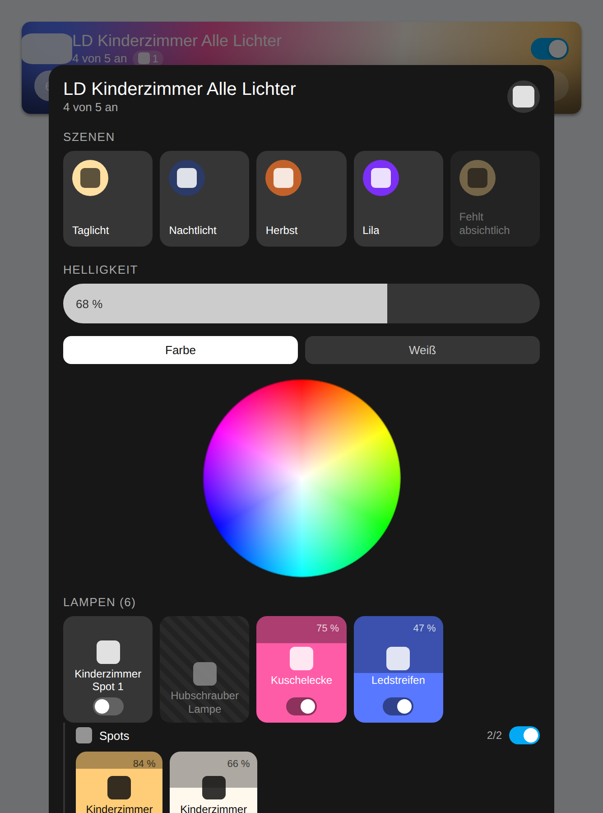
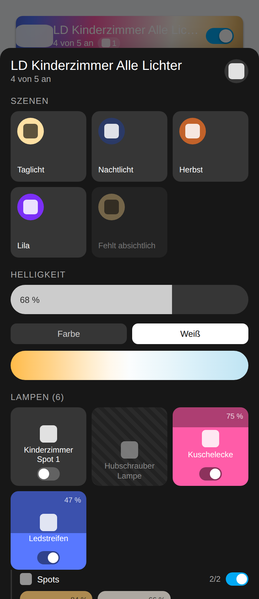

# Busch Light Cards

A Hue-like light and scene card for Home Assistant. One card:
**`busch-light-card`**.



The looks follow [lovelace-hue-like-light-card][upstream] by Gh61 — a big tile
that carries the light's own colour, a brightness slider on the card itself,
and a dialog with scenes, per-light tiles and colour pickers.

Two things work differently, and they are the reason this card exists.

## 1. Groups resolve on every level

Upstream treats `light.a_group` as one entity. It never reads the group's
`entity_id` attribute, so a group inside a group is a black box: you get one
tile, one aggregate state, and no way to reach the lights underneath.

This card walks the tree all the way down.

```
light.magic_areas_..._kinderzimmer_all_lights   (7 members, 3 of them groups)
├── light.kinderzimmer_spot_1
├── light.hubschrauberlampe
├── light.vorhang
├── light.ledstreifen_kinderzimm
├── light.kinderzimmerspots            ──► spot_1, spot_2, spot_3
├── light.lichtgruppe_kinderzimmer     ──► kinderzimmerspots, hubschrauberlampe,
│                                          vorhang, ledstreifen
└── light.leds_kinderzimmer            ──► kinderzimmerspots, vorhang, ledstreifen

resolves to 6 distinct lights, not 7 mixed entities
```

- **Every level**, not just the first. `max_depth` (default 10) is the only bound,
  and reaching it is reported rather than silently swallowed.
- **Three member attributes, because there is no single convention.**
  `entity_id` (Home Assistant light groups and old-style `group.*`),
  `group_entities` (**Zigbee2MQTT**, on lights and switches alike) and `lights`
  (Magic Areas). Reading only the first loses whole platforms: a Zigbee2MQTT
  group publishes nothing under `entity_id`, so it used to arrive as a single
  opaque entity.
  Two lists that *look* like membership are deliberately **not** followed, both
  measured on a live install: Magic Areas' `child_ids` names internal sub-group
  ids that resolve to nothing, and `switch.schedule_*` helpers carry an
  `entities` list of `climate.*` / `media_player.*` targets. Treating any list
  of entity ids as membership would turn a timer switch into a light group.
- **Duplicates collapse.** A light sitting in three parent groups is counted,
  shown and switched once.
- **Cycles terminate.** A group that contains itself, directly or through a
  chain, is expanded exactly once.
- **Only `light.*` and `switch.*` survive.** An old-style `group.*` holding
  `person.*` or `device_tracker.*` contributes its lights and drops the rest.
- **`entity_id` is followed only on `light`, `switch` and `group`.** `scene.*`
  and `automation.*` carry that attribute too, and expanding those would be
  nonsense.

Set `resolve_groups: false` to get the upstream behaviour back.

### …but they stay groups in the dialog

Resolving a group and *showing* a flat pile of lights are two different things.
With thirty lamps behind one card, the structure is the only thing that keeps
the dialog readable — so every resolved group keeps its own block, with its
name, how many of its lights are on, and a toggle that switches just that
group. Nested groups are indented.



- **Each light appears exactly once**, under the first group it was met in.
  Nothing is listed twice just because it sits in two parent groups.
- **The card's own root gets no heading.** Its name is already the dialog
  title; repeating it would put the same label on two different sets — every
  light above, only the direct ones below. Its tiles simply stand first.
- **A group that adds nothing new is named, not drawn.** `Lichtgruppe
  Kinderzimmer` and `LEDs Kinderzimmer` above hold only lights already shown,
  so they would render as empty headings. They get one line under the tiles
  instead — dropping them silently would hide that they exist at all.

`group_display: flat` gives one plain pile back.

## 2. An unavailable entity does not take the card down

Three separate problems, three fixes.

**A dead member no longer poisons the aggregate.** Counters, brightness and
colour come from the reachable members only, and every service call is
addressed to the reachable ones. The card says `4 von 5 an` with a badge
naming what is missing, instead of quietly reporting the wrong number or
pushing a call that Home Assistant rejects.

**A missing entity renders instead of throwing.** Upstream raises
`Entity 'x' not found in states.` when a group member has been deleted from
the registry. Here it becomes a leaf shown as unavailable.

**An unavailable group keeps its members.** This is the one that bites hardest.
Measured on Home Assistant 2026.8.3: when a `light` group goes unavailable, HA
**drops its `entity_id` attribute entirely** — friendly name and colour
capabilities stay, the member list is gone. Any card that reads membership from
live state therefore watches a 12-light group collapse into a single dead
entity. This card remembers the last member list it saw and keeps using it
while the group is unreachable.

> The memory is only consulted while the entity is actually unavailable. An
> available group that lists nothing really is a leaf, and a stale memory must
> not override that. On a cold start — HA restarted while the group was already
> down — there is nothing to remember, and the group degrades to a single
> unavailable entity. That is honest, not fixed.

Only when *every* member is unreachable does the card switch to a disabled
state, and it still says so in words rather than erroring.

## The dialog



- **Scene tiles** — one square tile per scene, the colour riding in a round
  badge rather than flooding the tile, so the label stays readable whatever
  colour it carries. The icon comes from the scene itself. A scene entity that
  does not exist is greyed out and disabled, not a crash.
- **Light tiles** — each carries its own switch, so on/off is one visible tap
  instead of a gesture nobody discovers. Tapping the tile body opens that
  light's detail view; dragging up and down dims it. The shading runs from the
  top and shows the *missing* brightness, so a dim lamp looks dim.
- **Group brightness** — moves the lit members while anything is lit, and every
  reachable member when all are off. That is what the Hue app does.
- **Colour / White** — an HSV wheel and a colour-temperature bar drawn along
  Hue's own curve (2000 K → 4200 K → 6500 K), not a black-body approximation.
  The bar spans the **intersection** of the members' supported ranges, so it
  can never ask a lamp for a temperature it cannot do.
- **An unreachable light** is hatched, inert and named — hiding it would make a
  missing lamp look like a lamp that was never in the group.



## Install

**HACS → three-dot menu → Custom repositories** →
`luukkii123/ha-busch-lightcards`, category **Dashboard**. Then install, and
hard-refresh the browser (`Ctrl+Shift+R`) — otherwise the old file stays cached.

Manual: drop `dist/busch-lightcards.js` into `/config/www/` and add it under
**Settings → Dashboards → Resources** as a JavaScript module.

## Configure

There is a visual editor — pick the card in the dashboard's card picker and
every option below has a field. Three things about it are worth knowing:

- **The editor previews the resolution live.** While you are still choosing an
  entity it already says `Löst auf zu: 6 Lampen aus 4 Gruppen, Tiefe 2` and
  lists every light it found, with the unreachable ones hatched. Otherwise
  "resolve nested groups" would be a switch whose effect you cannot see until
  the card is placed.
- **It writes only what differs from the default.** Turning the slider off
  produces three lines, not twenty. Setting an option back to its default
  removes the key again instead of pinning it.
- **A config in upstream camelCase is folded into snake_case** the first time
  you open it (`resolveGroups` → `resolve_groups`). Keeping both spellings of
  one option would let them drift apart silently.
- **One button imports every scene that uses these lights.** It matches
  against the resolved lights *and* the groups walked through — scenes often
  name the group rather than its lamps, and matching leaves alone would miss
  exactly the ones worth having. What it adds, the ordinary delete button
  removes again, and the button then offers that scene back: an import must not
  be a one-way door.

The colour fields are text, not swatches, on purpose: `off_color` has to be
*emptiable* so the theme can decide, and the fields also accept `warm`, `cold`
and `rgb(…)`. Scene tiles use a real colour picker, because there a colour is
always wanted.

YAML works just as well:

```yaml
type: custom:busch-light-card
entity: light.magic_areas_light_groups_ld_kinderzimmer_all_lights
scenes:
  - entity: scene.taglicht
    color: "#ffe0a3"
  - entity: scene.nachtlicht
    color: "#2b3a67"
  - scene.herbst
```

| Option | Default | What it does |
| --- | --- | --- |
| `entity` | — | The group or light to control. One of `entity`/`entities` is required. |
| `entities` | — | Several roots at once; all of them are resolved and merged. |
| `title` | group name | Card heading. |
| `icon` | group icon | Card icon. Falls back to `mdi:lightbulb-group`. |
| `description` | auto | Replaces the `4 von 5 an` line with fixed text. |
| `resolve_groups` | `true` | **Set `false` for upstream behaviour**: the group stays one entity. |
| `max_depth` | `10` | How deep to follow nested groups. |
| `group_display` | `sections` | `sections` keeps each resolved group as its own block in the dialog; `flat` shows one plain pile of tiles. |
| `show_unavailable` | `true` | Show the badge counting unreachable members. |
| `scenes` | `[]` | Scene entity ids, or `{entity, title, icon, color}` objects. |
| `off_color` | theme | Card background while everything is off. |
| `default_color` | `warm` | Colour used when a lit light reports none. |
| `hue_borders` | `true` | Hue's rounded corners and drop shadow. |
| `show_switch` | `true` | The on/off toggle on the card. |
| `slider` | `true` | The brightness slider on the card. |
| `allow_zero` | `false` | Let the slider reach 0 (which turns the group off). |
| `off_shadow` | `true` | Inset shadow while off. |
| `tap_action` | `dialog` | `dialog`, `toggle`, `more-info` or `none`. |
| `hold_action` | `more-info` | Same set of values. |

Every option is also accepted in camelCase (`resolveGroups`, `offColor`, …) so
a config copied from the upstream card keeps working.

## Proof

`docs/render/render.py` runs the shipped file in real Chromium, serves it over
HTTP (so a stray sub-resource would be a real 404), drives the card's own logic
through `BuschLightCard.__internals`, and writes every assertion, network
request, console error and page error to `report.json`. A sample run is checked
in as `docs/render/report-beispiel.json`.

The fixture in `docs/render/fixture.json` is captured verbatim from a live
Home Assistant 2026.8.3 — real names, real colour capabilities, real kelvin
ranges, real nested membership, and a genuinely unavailable lamp. The only
invented values are the `lit` scenario's brightness and colour, so the
screenshots are not of an all-off card; each is marked `"_synthetic": true`.

```bash
docker run --rm \
  -v "$PWD:/repo" \
  --entrypoint bash mcr.microsoft.com/playwright/python:v1.62.0-noble \
  -c 'pip install --quiet --break-system-packages playwright==1.62.0 >/dev/null; \
      python3 /repo/docs/render/render.py /repo/dist/busch-lightcards.js /repo/docs/render/ergebnis'
```

79 checks, covering: the hand-derived leaf list, duplicate collapse, cycles,
self-reference, deleted members, foreign domains, the depth limit, the
unavailable-group memory (cold and warm), aggregation, service-call routing,
the rendered card text, the dialog and how it stacks against a Leaflet-grade
z-index, the group blocks (structure, per-group counts and toggles, the
already-shown note, `flat` mode), Zigbee2MQTT resolution with a control run
that removes `group_entities` again, the two attributes deliberately not
followed, scene import (matching, group-only scenes, reversibility), the tile
layout, and the visual editor (option coverage,
labels, live preview, minimal output, camelCase folding, scene add/reorder/
delete, colour round-trip).

**Two things are explicitly not proven.**

*The editor's checks use a stubbed `ha-form`.* The stub honours the contract
the editor relies on — `hass`/`schema`/`data`/`computeLabel` in, a
`value-changed` event carrying the full data object out — so it proves the
editor's wiring, the schema shape and the config it produces. It does **not**
prove that Home Assistant's own `ha-form` renders those selectors as intended.
For the same reason there is no editor screenshot here: it would be a picture
of the stub.

*None of this has run against a live dashboard.* The logic and the rendering
are tested; the two together in a running Home Assistant are not.

## Why there is no build step

The repository lives on an SMB share where `npm` is not an option. The file is
source and delivery in one: plain custom elements, no Lit, no bundler, no
sub-resources. A HACS dashboard resource cannot serve files from subfolders
anyway, so everything a card needs has to be in the one file.

## Licence

MIT. Not affiliated with, or endorsed by, Signify/Philips Hue.

[upstream]: https://github.com/Gh61/lovelace-hue-like-light-card
